### 介绍
此项目为作者Vue前端框架高级课程的期末作业。模仿教学案例——51购物商城。

项目运行界面展示：

#### 首页

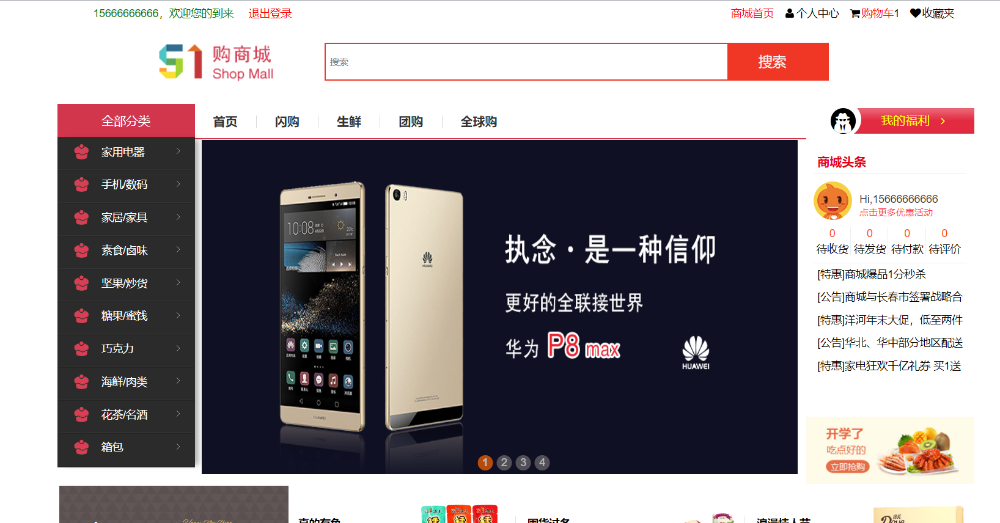

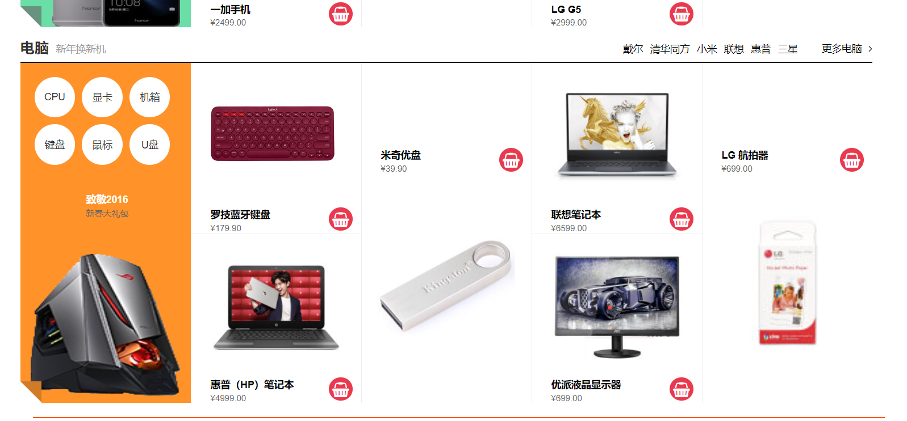

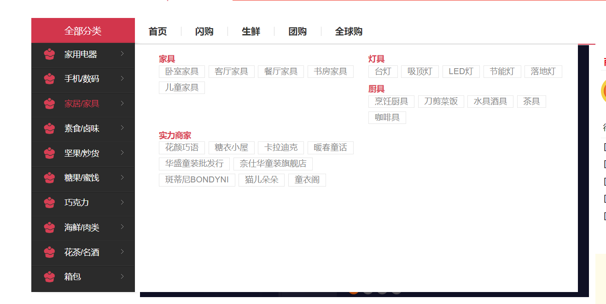

#### 购物车页

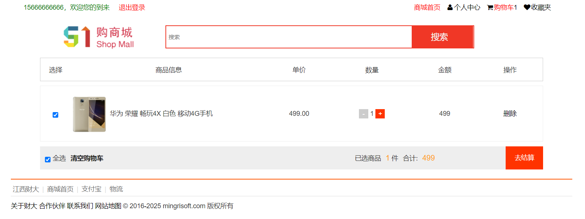

#### 结算页

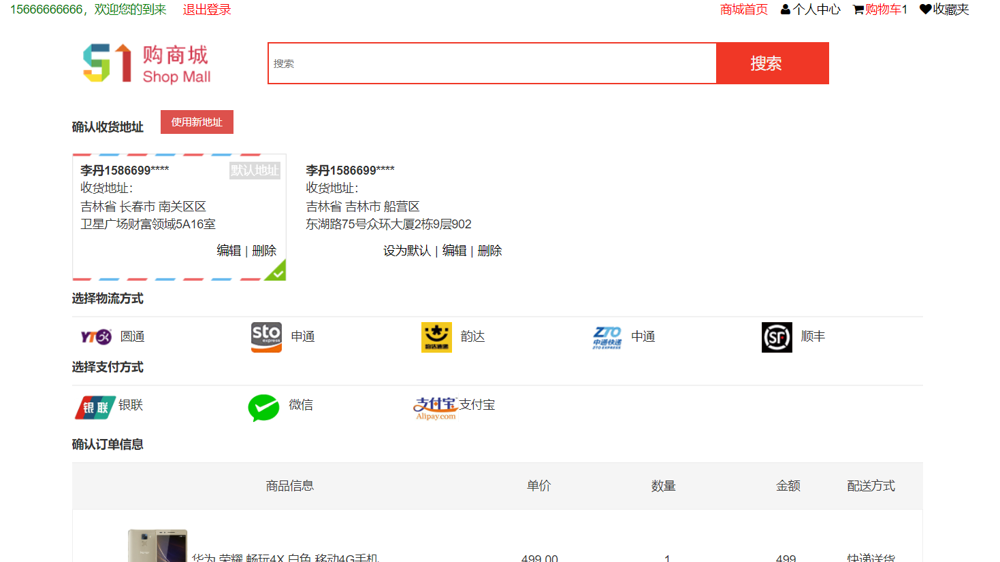

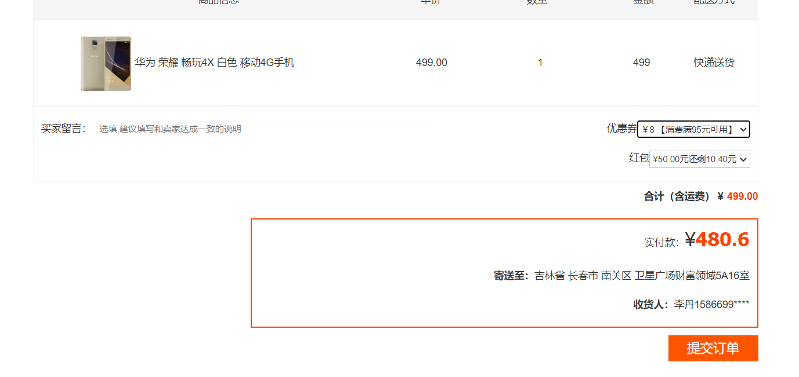

#### 登录页

* 密码使用aes加密了

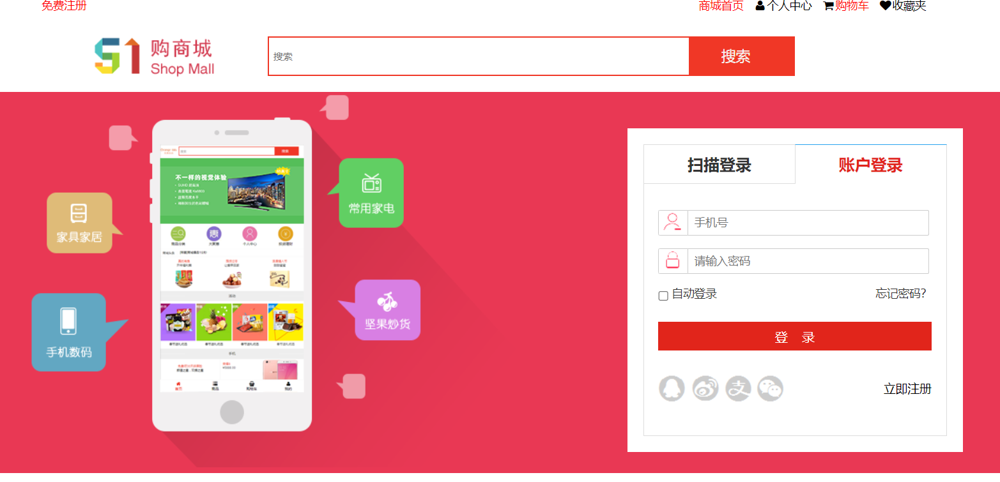

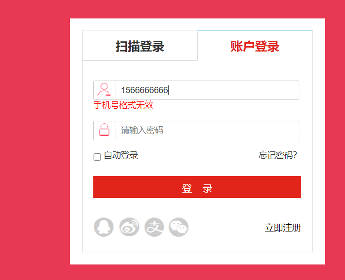

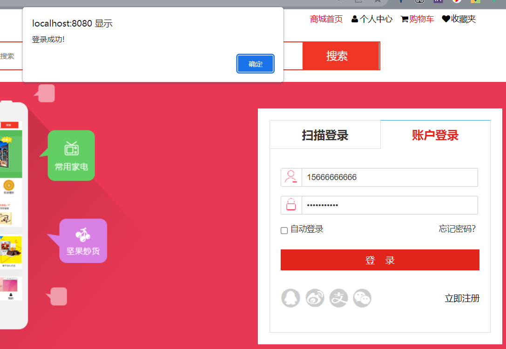

#### 注册页

* 会检索本地数据,如果有的话就会注册失败!

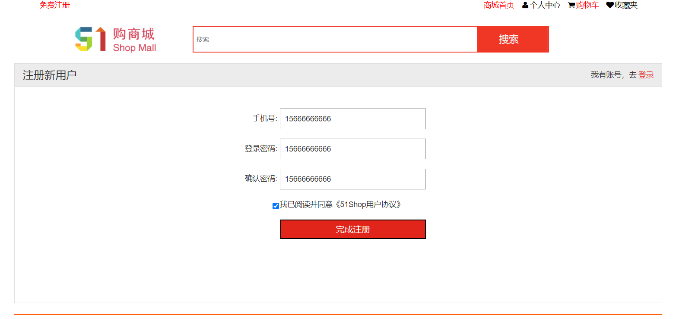

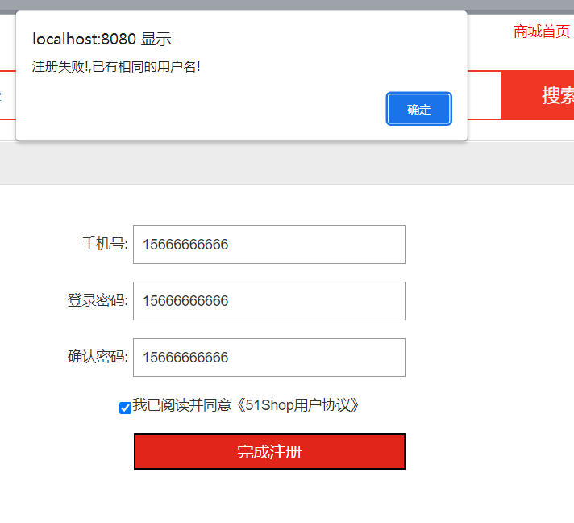

#### 商品详情

* 有一个放大镜效果~

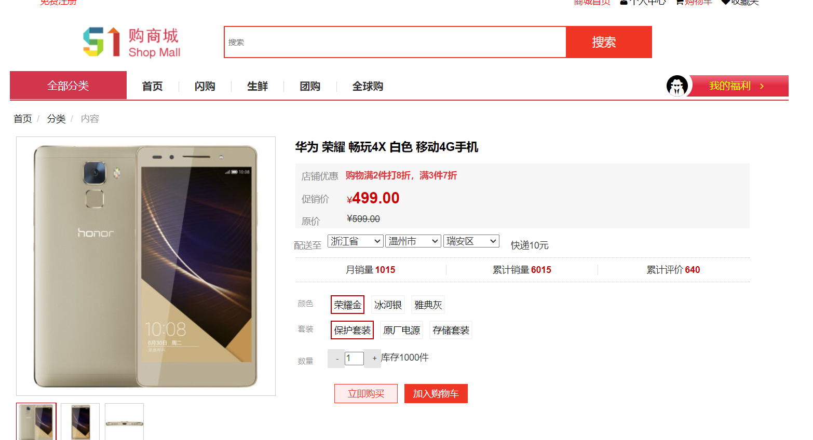

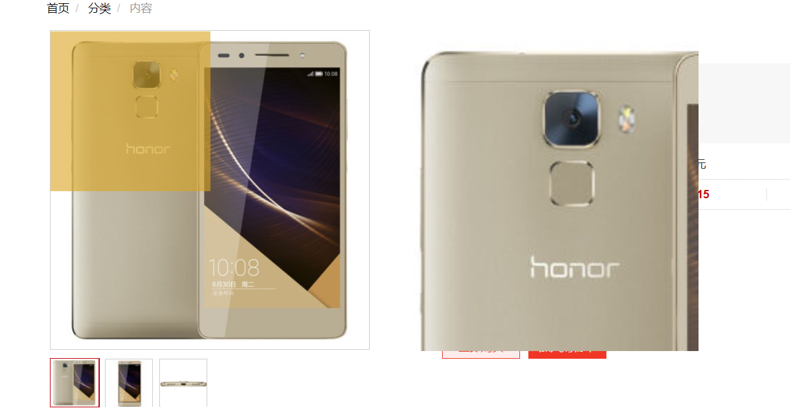

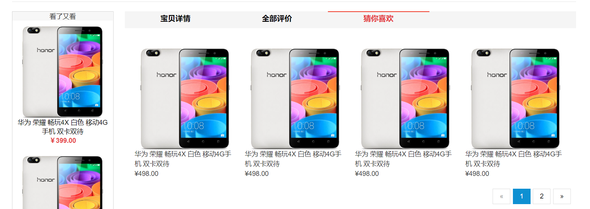

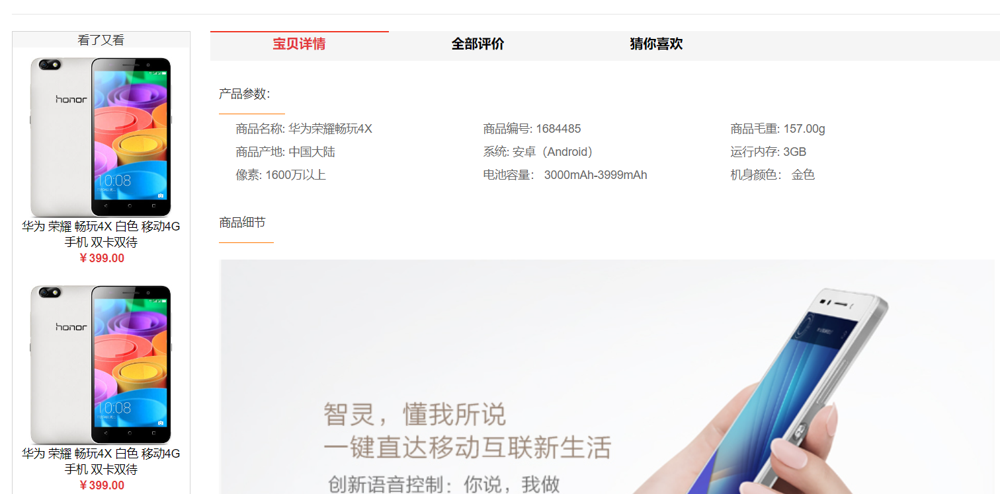

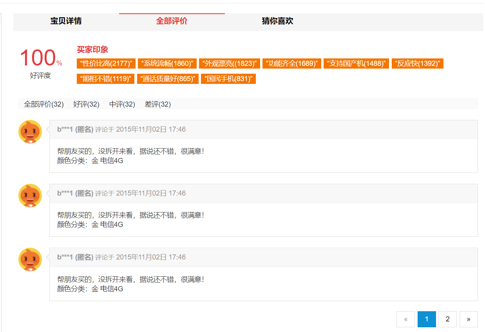